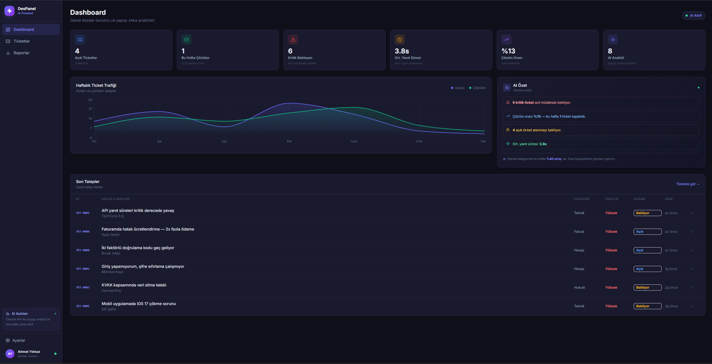
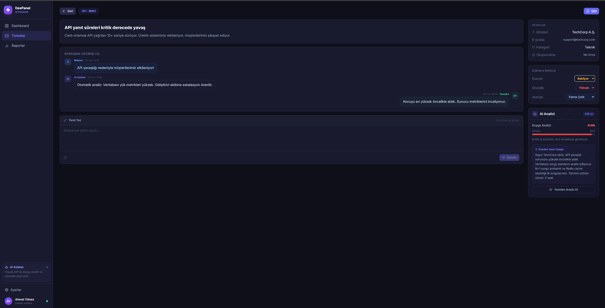
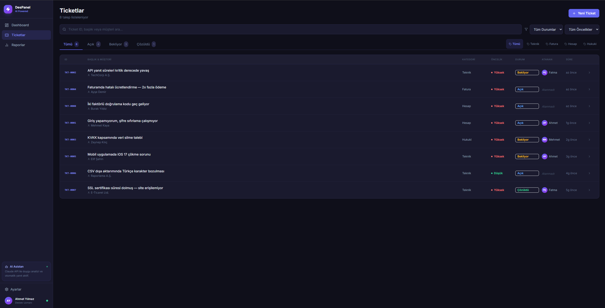
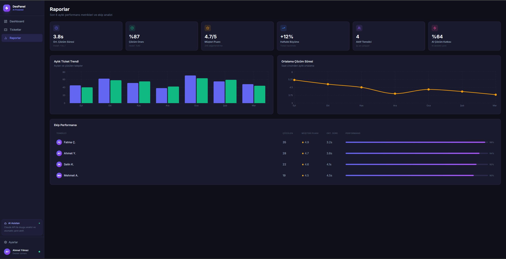
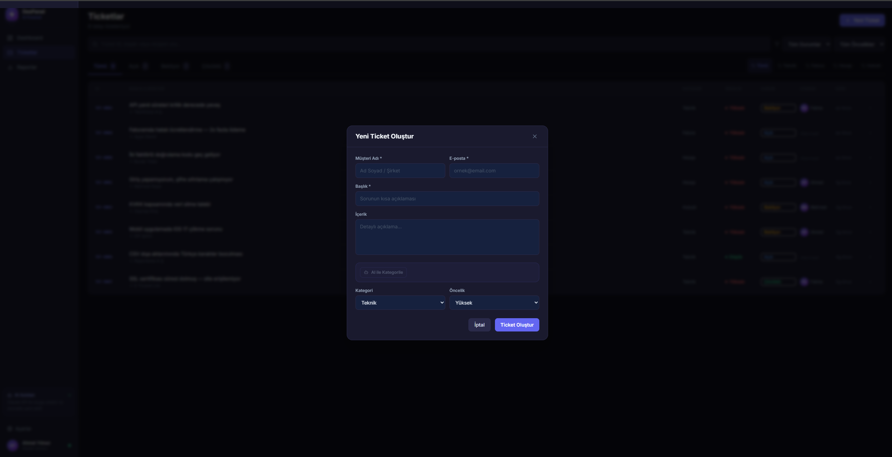

# ⚡ AI Destek Paneli

Influencer ve içerik üreticileri için geliştirilmiş, yapay zeka destekli modern müşteri destek yönetim sistemi. **Claude AI** entegrasyonu ile otomatik duygu analizi, akıllı yanıt önerileri ve gerçek zamanlı ticket yönetimi sunar.


---

## 📸 Ekran Görüntüleri

<div align="center">
  
  <br/>
  
  
  
  <br/>
  
  
</div>

---

## ✨ Özellikler

### 🎫 Ticket Yönetimi
- Ticket oluşturma, listeleme, detaylı arama ve filtreleme.
- **Durum Takibi:** Açık → Bekliyor → Çözüldü geçişleri.
- **Öncelik Seviyeleri:** Düşük, Normal, Yüksek ve Acil seviye atamaları.
- **Kategori Sınıflandırması:** Teknik, Fatura, Hesap, Hukuki, Genel.
- Müşteri profili entegrasyonu ile kesintisiz mesaj geçmişi.

### 🤖 Yapay Zeka (Claude API)
- **Duygu Analizi:** Gelen mesajların Olumlu / Nötr / Olumsuz / Kritik olarak anlık sınıflandırılması.
- **Aciliyet Skoru:** İçeriğe göre 0–100 arası otomatik öncelik puanlaması.
- **Otomatik Yanıt Önerisi:** Kategoriye ve geçmiş konuşma bağlamına özel profesyonel yanıt taslakları üretimi.
- *Fallback Modu:* API anahtarı yoksa sistemin kesintiye uğramadan şablon tabanlı simülasyon moduna geçebilmesi.

### 📊 Dashboard ve Raporlar
- Gerçek zamanlı KPI kartları (Açık ticket, çözüm oranı, ortalama yanıt süresi).
- Haftalık açılan/çözülen taleplerin trend analiz grafikleri.
- Ekip bazlı performans tabloları ve çözüm süreleri.
- AI tabanlı içgörüler ve sistem uyarıları paneli.

---

## 🛠️ Teknoloji Yığını

| Katman | Teknoloji |
|--------|-----------|
| **Framework** | Next.js 16 (App Router) |
| **UI Kütüphanesi** | React 19, Tailwind CSS |
| **Veri Görselleştirme** | Recharts |
| **İkonlar** | Lucide React |
| **Tarih İşlemleri** | date-fns |
| **Yapay Zeka** | Anthropic Claude API (`@anthropic-ai/sdk`) |
| **Tip Güvenliği** | TypeScript (Strict Mode) |

---

## 🚀 Başlarken

### Gereksinimler

- Node.js 18+
- npm veya yarn
- *Opsiyonel:* Anthropic API Anahtarı

### Kurulum Adımları

```bash
# Repoyu klonla
git clone [https://github.com/KULLANICI_ADIN/ai-destek-paneli.git](https://github.com/KULLANICI_ADIN/ai-destek-paneli.git)
cd ai-destek-paneli

# Bağımlılıkları yükle
npm install

# Ortam değişkenlerini oluştur
cp .env.example .env.local
